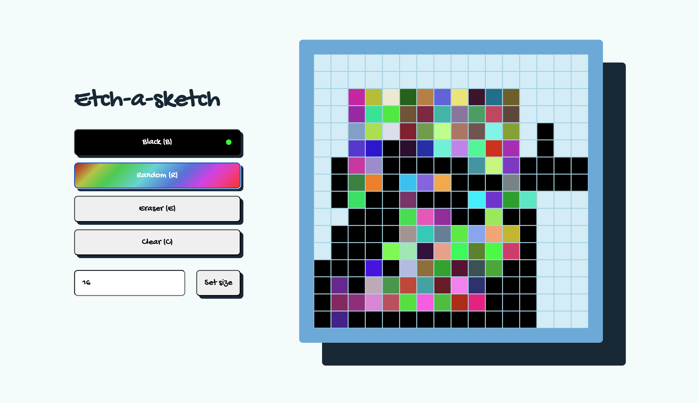

# Etch a Sketch

A project from The Odin Project to practice JavaScript and DOM manipulation.

[Live Preview](https://nerdynischal.github.io/odin-etch-a-sketch-new/)  
[Source Code](https://github.com/nerdynischal/odin-etch-a-sketch-new)

## Description

A browser version of a mix between a pixelated sketchpad and Etch a Sketch.

## Techonologies used

- HTML/CSS
- JavaScript
- Sass/SCSS

## Inspiration, code snippets, and other helpful resources

- [YouTube video of project walkthrough by Coding With Rob](https://www.youtube.com/watch?v=dyhuaXeuyGo&t=1201s&ab_channel=CodingWithRob)
- [A (more) Modern CSS Reset](https://piccalil.li/blog/a-more-modern-css-reset/)
- [Random color code from css-tricks ](https://css-tricks.com/snippets/javascript/random-hex-color/)

## Upcoming features

- Add feature to draw only when mouse is pressed
- Add responsiveness
